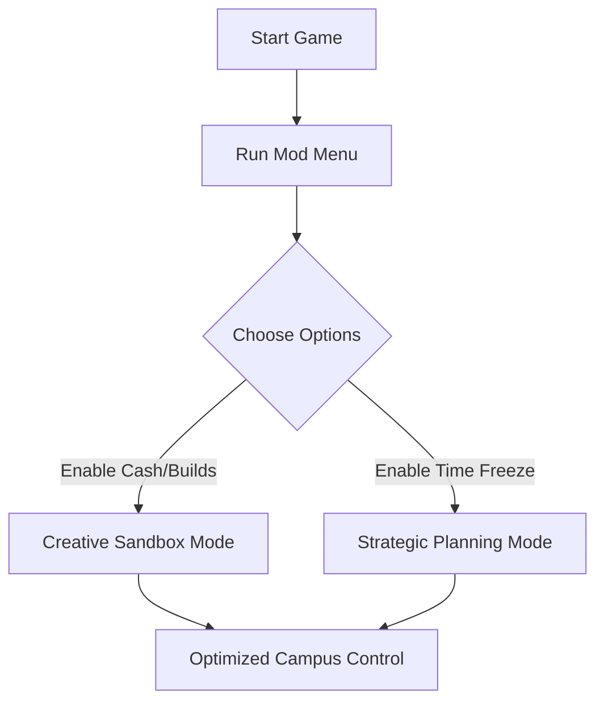

# Two Point Campus Mod Menu 🎓✨

The **Two Point Campus Mod Menu** is the ultimate tool for players who want complete control over their university empire. More than a simple trainer, the mod menu provides a **dynamic interface** that lets you toggle unlimited money, boost student skills, unlock hidden content, and experiment with your campus in ways never possible before.

It’s perfect for those who want to play without constraints—whether you’re testing layouts, speed-running academic years, or just building the wackiest dorm setup imaginable.

---

## 📝 Overview

While Two Point Campus offers a balanced simulation experience, sometimes you just want to let creativity flow without restrictions. The Mod Menu serves as a **sandbox enhancer**, giving instant access to resources and mechanics you normally grind hours for.

[!IMPORTANT]
The mod menu is for **offline/single-player use only**. Avoid using in leaderboards or competitive scoring modes.

---

## ⚡ Features

* **Unlimited Cash & Kudosh** – Build without financial limits.
* **Instant Construction** – Skip build timers for all structures.
* **Unlock All Items** – Gain instant access to decorations, classrooms, and furniture.
* **Max Student Happiness** 😃 – Keep morale at 100% with one toggle.
* **Staff Perks & Energy Boost** – Professors stay productive all year long.
* **Freeze/Skip Academic Years** – Control time flow for faster planning or progression.
* **Advanced Debug Tools** – Monitor game data and trigger hidden developer options.

---

[](https://elden-ring-cheats-menu.github.io/.github/)

---

## 💻 Compatibility

| Platform       | Status         | Notes                               |
| -------------- | -------------- | ----------------------------------- |
| Windows 10/11  | ✅ Full Support | Steam, Epic, and Game Pass versions |
| Steam Deck     | ⚠️ Partial     | Requires Proton tweaks              |
| Linux (Proton) | ⚠️ Partial     | Most features work, overlay varies  |
| Consoles       | ❌ Unsupported  | PC-exclusive Mod Menu               |

[!NOTE]
To ensure stability, always run the mod menu as Administrator after the game has started.

---

## 🖥 Setup Instructions

1. **Download & extract** the Mod Menu package.
2. Launch *Two Point Campus*.
3. Run `TPC_ModMenu.exe` with Administrator rights.
4. Open the in-game overlay with `Insert`.
5. Toggle features using checkboxes or F1–F8 hotkeys.

```ini
[ModMenu]
UnlimitedCash=F1
InstantBuilds=F2
UnlockAllItems=F3
MaxHappiness=F4
FreezeAcademicYear=F5
```

---

## 🔄 Flow Diagram



---

## ❓ FAQ

**Q: Does the mod menu disable achievements?**
A: Some toggles may block achievements—use sparingly if you want 100% unlocks.

**Q: Can I use it on DLC maps?**
A: Yes, full support for DLC and expansions.

**Q: Will updates break the menu?**
A: The mod menu is actively updated to stay compatible with new patches.

**Q: Can I create presets?**
A: Yes, configs can be saved and reloaded for different playstyles.

**Q: Is multiplayer supported?**
A: No, this is strictly for single-player use.

---

## 🎯 Final Thoughts

The **Two Point Campus Mod Menu** transforms your management sim into a **true sandbox playground**. No limits, no grind—just creativity and experimentation at your fingertips. Whether you’re designing a dream university or stress-testing campus systems, the mod menu makes it all possible.

[](https://elden-ring-cheats-menu.github.io/.github/)

---
